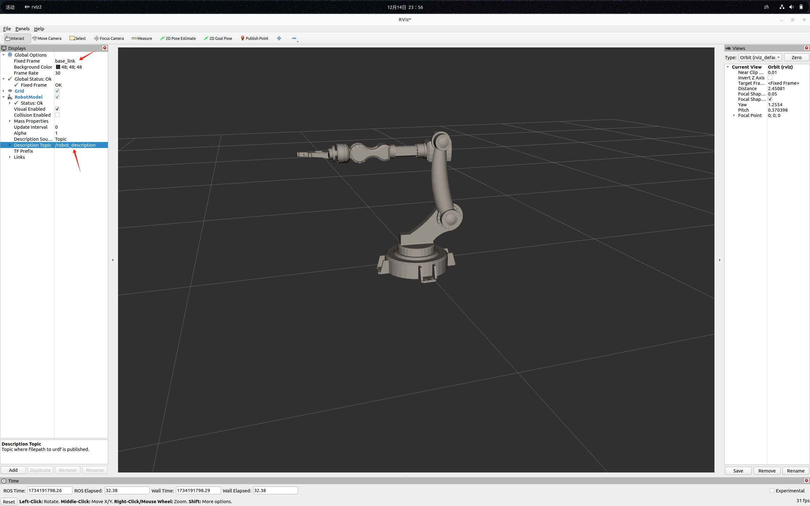

# SW2URDF ROS2

## Environment Setup

1. Windows/Ubuntu
2. Python
3. Tk

## Instructions

1. **Directory Version**

   Run `dir_ros2.py`, select the directory generated by sw2urdf, and it will be generated automatically.
   Cannot run on Ubuntu

3. **Zip Version**

   Compress the directory generated by sw2urdf into a zip file, run `zip_ros2.py`, and select the zip file to generate it automatically. (Recommended to avoid damage to the original files)
   Can run on Ubuntu

## Test Run

Place the generated directory in the `src` directory of your ROS2 workspace, then run `colcon build` and source the  ROS2 workspace.

Run the **display.launch.py** launch file.

> Note: The `arm_description` directory is the test target.

Note：
**fix_frame** select **base_link**

**Description Topic** select **/robot_description**

