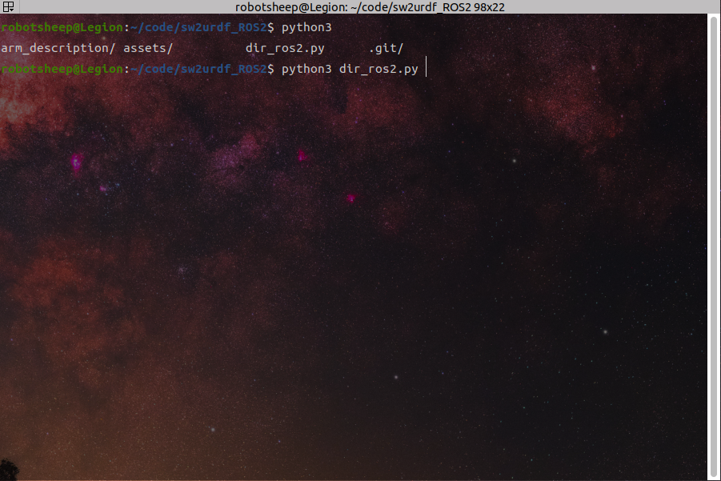
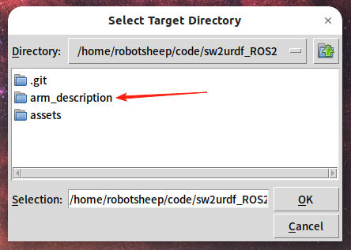
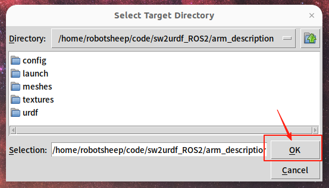
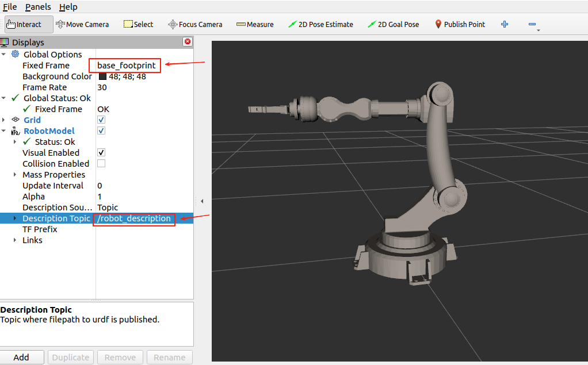
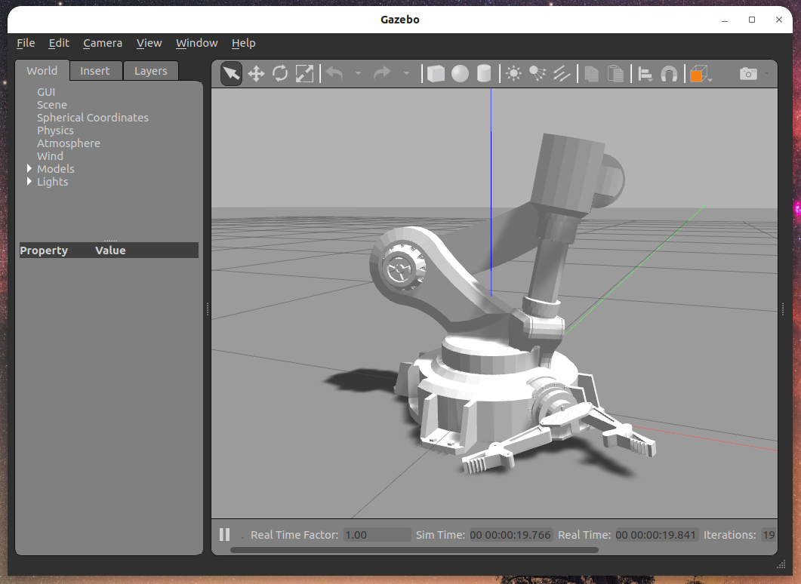

# SW2URDF ROS2

## 环境配置

1. Ubuntu
3. ROS2
4. Gazebo11
5. gazebo_ros
6. robot_state_publisher
7. joint_state_publisher

## 安装依赖

```bash
# install Gazebo and gazebo_ros
sudo apt install gazebo && sudo apt install ros-$ROS_DISTRO-gazebo-ros-pkgs
```


```bash
# install robot_state_publisher and joint_state_publisher
sudo apt install ros-$ROS_DISTRO-robot-state-publisher && sudo apt install ros-$ROS_DISTRO-joint-state-publisher
```

## 工具说明

运行dir_ros2.py选择sw2urdf生成的目录，自动转化sw2urdf生成的目录为ROS2可用的功能包。

此功能包可以在**rviz2，gazebo**中显示模型。

## 必要设置

在insert_urdf.txt里设置base_footprint和base_link的几何关系

```xml
  <link name="base_footprint"/>

  <joint name="base_footprint_joint" type="fixed">
      <origin xyz="0 0 0.001" rpy="0 0 0" />
      <parent link="base_footprint"/>
      <child link="base_link" />
  </joint>
```

## 运行测试

### 转化目录

1. 运行dir_ros2.py



2. 选择你的sw2urdf生成的原始目录，注意先压缩一份备份，防止失败。



3. 要点进去这个目录，然后点击OK，等待完成即可。



4. 把转化后的目录放到ROS2工作空间的src目录下，colcon build然后source工作空间。

### rviz2

运行 **display.launch.py** launch文件

> 注：arm_description目录为测试目标

```bash
ros2 launch arm_description display.launch.py
```

注意
**fix_frame**选择 **base_footprint**

**Description Topic**选择 **/robot_description**


### Gazebo
运行 **gazebo.launch.py** launch文件

> 注：arm_description目录为测试目标

```bash
ros2 launch arm_description gazebo.launch.py
```



这里的效果是因为我没加控制器，但是模型加载没有问题
